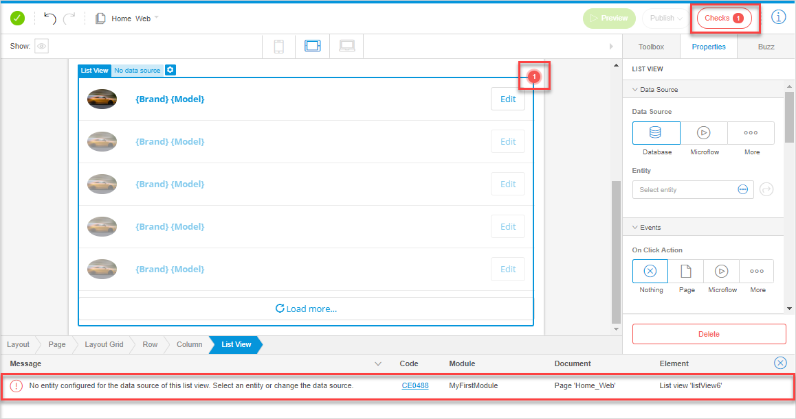

## 1 Introduction 

Mendix Studio checks your app for consistency in real-time, for example, it checks if any necessary properties of elements are missing. Such checks help you build an app that will function properly. 

If your app passes the check, the **Checks** button will have a green check mark and the app will be ready to be [previewed or published](publishing-app):

If the app does not pass the check, you see the **Checks** button goes red with the number of failed checks – [consistency errors](consistency-errors). If you click the button, a **Checks** panel with the list of errors will open and the elements that did not pass the check will be highlighted. This list can be seen as a to-do list that you need to complete before your app can be [previewed or published](publishing-app).

{}

**Preview** and **Publish** become available only when the app is fully consistent and all checks have been solved.

{}

## 2 Viewing Checks and Interacting with the Checks Panel {#viewing-checks}

If your app has consistency errors, the **Checks** button will have the red border and the number of errors will be indicated on the button. To display consistency errors for your app and view the impacted elements in it, you can do the following:

1. Click the **Checks** button or press the <kbd>C</kbd> shortcut to open the **Checks** panel:

    

    The panel with the list of consistency errors appears at the bottom of the screen. For more information on the **Checks** panel, see the [Checks Panel Overview](#checks-panel-overview) section below.

    

4. To view the exact place and element that the error refers to in the corresponding editor, click the row in the **Checks** panel (you can click any place of the row, the whole row is responsive), and the element that failed a check will be displayed and highlighted.

5. To close the panel, either click the close button in the top-right corner of the panel, click **Checks** in the top-right corner of Studio, or press <kbd>C</kbd> . 

To sort the errors, click the column header in the panel. Thus, you can sort errors in ascending or descending order by **Message**, **Code**, **Module**, **Document**, or **Element**. For more information on items displayed in the **Checks** panel, see the [Checks Panel Overview](#checks-panel-overview) section. 

{}

If there are no consistency errors, the **Checks** panel will be empty and **Preview** and **Publish** buttons will be clickable. 

{}

## 3 Checks Panel Overview {#checks-panel-overview}

### {#checks-panel-overview}

The **Checks** panel is represented as a table and shows you a list of consistence errors. This prevents your app from functioning in an incorrect way and being published (for example, if you do not specify an entity for the data view, your app cannot function correctly). For more information on consistency errors, see [Consistency Errors](consistency-errors). 

The items displayed in the table of the **Checks** panel are described below. 

| Item     | Description                                                  |
| -------- | ------------------------------------------------------------ |
| Message  | Contains an explanation of the error and an error code. If an error has documentation and an explanation how to fix it, the error code is underlined and clickable, and the corresponding documentation opens. |
| Module   | Indicates the module where the error is found.               |
| Document | Indicates the place of your app where the error is found (for example, a page, a microflow). |
| Element  | Indicated the exact element that is faulty (button, activity, etcetera ). |

## 4 Read More

* [Consistency Errors](consistency-errors)
* [Previewing & Publishing Your App](publishing-app)
* [General Info](general)
